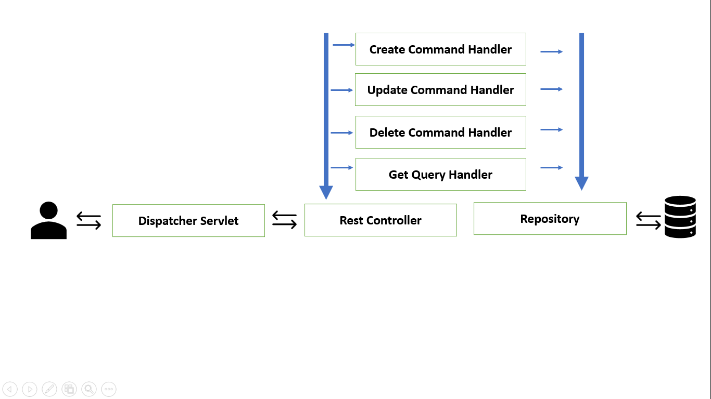

Spring Boot Restful Api with CQRS - Design Pattern
===
## Intro:
**This project gives you Straight-forward intro with 
Command Query Responsibility Segregation in Spring Boot With Rest Api.**

## DrawBacks:
* Not complex project
* Not handle all exception case
* Swagger Api Documentation: http://localhost:8080/swagger-ui.html
* High-level CQRS Design Pattern :
